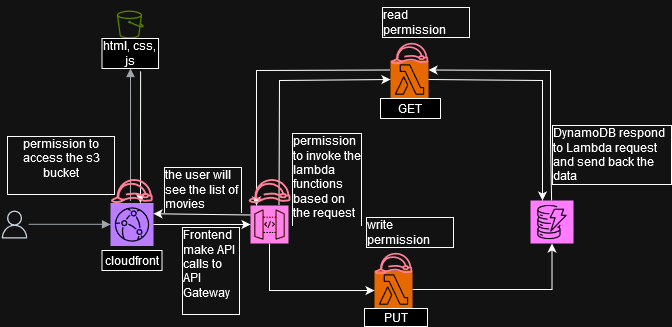

# movieAPI
project to apply AWS CloudFront-S3-IAM Roles-Lambda-DynamoDB-API Gateway

with this project I want to increase my expertise with a serverless architecture, using Lambda-DynamoDB, S3 e cloudfront to deploy a SPA where it will be displayed a list of movies and the possibility to filter them, based on the title, or add one to the list.

Here's a high-level overview of the process:
1. Set up the AWS environment:
   - Create an AWS account if you don't have one
   - Set up AWS CLI and configure credentials

2. Set up version control:
   - Create a new GitHub repository for your project

3. Design the architecture:
   - Amazon API Gateway for RESTful API
   - AWS Lambda for serverless backend logic
   - Amazon DynamoDB for data storage
   - Amazon S3 for static web hosting
   - Amazon CloudFront for content delivery
   - AWS IAM for managing permissions

4. Create Terraform configuration:
   - Define the AWS provider
   - Create resources for S3, DynamoDB, Lambda, API Gateway, CloudFront, and IAM roles
   - Set up DynamoDB table for storing movie data
   - Configure Lambda functions for CRUD operations
   - Set up API Gateway to trigger Lambda functions
   - Configure S3 bucket for static website hosting
   - Set up CloudFront distribution pointing to S3 bucket

5. Develop the backend:
   - Write Lambda functions in your preferred language (e.g., Python, Node.js)
   - Implement functions for listing movies, searching, and adding new movies

6. Develop the frontend:
   - Create a simple HTML page with JavaScript for interacting with the API
   - Implement the search functionality and form for adding new movies

7. Set up GitHub Actions:
   - Create a workflow file (.github/workflows/deploy.yml)
   - Configure the workflow to run Terraform commands
   - Set up AWS credentials as GitHub secrets

8. Local testing:
   - Test Terraform configurations locally
   - Test Lambda functions using AWS SAM or localstack

9. Initial deployment:
   - Push your code to GitHub
   - Let GitHub Actions run the initial deployment

10. Configure custom domain (optional):
    - Register a domain with Amazon Route 53 or your preferred registrar
    - Set up SSL certificate using AWS Certificate Manager
    - Update CloudFront distribution with custom domain and SSL certificate

11. Continuous deployment:
    - Make changes to your code or infrastructure
    - Push changes to GitHub
    - GitHub Actions will automatically apply changes

12. Monitoring and logging:
    - Set up CloudWatch Alarms for monitoring
    - Configure CloudWatch Logs for Lambda functions

13. Cost optimization:
    - Review and optimize resource usage
    - Set up AWS Budgets to monitor costs

14. Documentation:
    - Write a README.md explaining the project structure and how to deploy it
    - Document the API endpoints and how to use them

15. Sharing your project:
    - Update your GitHub repository with documentation
    - Create a simple landing page or blog post showcasing your project

This approach creates a serverless, scalable web application that can be easily deployed and maintained. The use of Terraform allows for infrastructure as code, making it reproducible and version-controlled, while GitHub Actions automates the deployment process.
